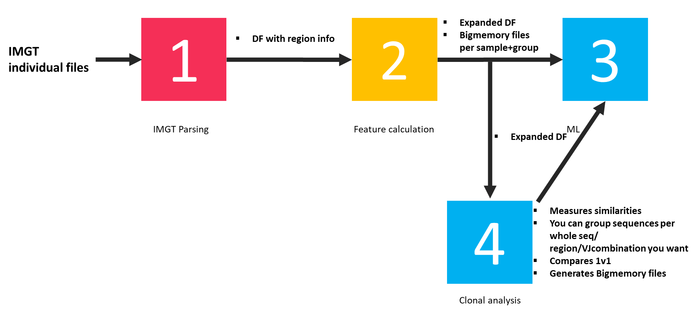
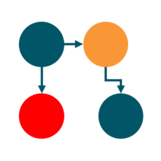

<!-- badges: start -->
[](https://www.gnu.org/licenses/gpl-3.0)
<!-- badges: end -->

<p align="center">
  
</p>

# AbSolution <a id="top"></a>

**An interactive and scalable Shiny application for analyzing sequence features of B-cell and T-cell receptor repertoires.**

AbSolution supports identification and visualization of variable region characteristics, clonotypes, and mutation patterns from immunoglobulin and TCR sequence data. It has been designed under the principles of accessibility, scalability, flexibility, interactivity, and reproducibility.

---

## Features

- **AIRR-Seq parsing**: import and parse AIRR-formatted sequence data with automatic germline reconstruction
- **Sequence feature extraction**: nucleotide/amino acid properties, mutation analysis, physicochemical descriptors (Kidera factors, Atchley factors, etc.)
- **Scalable computation**: backed by file-backed big matrices ([bigstatsr](https://github.com/privefl/bigstatsr)) for large repertoires
- **Interactive visualization**: PCA/UMAP projections, violin plots, clonal frequency distributions, UpSet plots for shared clones
- **Differential analysis**: variable selection between user-defined groups with univariate logistic regression
- **Clonal exploration**: multiple clonotype definitions, shared clone detection, dominance analysis
- **Reproducible exports**: ENCORE-formatted output bundles with code, data, Docker environment, and rendered reports

---

## Installation

### From GitHub

```r
# Install Bioconductor dependencies first
if (!requireNamespace("BiocManager", quietly = TRUE))
    install.packages("BiocManager")
BiocManager::install(c("Biostrings", "IRanges", "pwalign"))

# Install AbSolution
if (!requireNamespace("remotes", quietly = TRUE))
    install.packages("remotes")
remotes::install_github("EDS-Bioinformatics-Laboratory/AbSolution")
```

### From source

```r
install.packages("AbSolution_1.0.0.tar.gz", repos = NULL, type = "source")
```

### Docker

A Docker setup is available in the [`deploy/`](deploy/) directory:

```bash
cd deploy
docker build -f Dockerfile_base --progress=plain -t absolution_base .
docker build -f Dockerfile --progress=plain -t absolution:latest .
docker run -p 3838:3838 absolution:latest
# Open http://127.0.0.1:3838
```

---

## Quick start

```r
library(AbSolution)
run_app()
```

This launches the Shiny application. A built-in test dataset is available to explore all features without needing your own data.

For a complete guide, see the package vignette:

```r
vignette("AbSolution")
```

---

## Workflow overview

<p align="center">
  
</p>

AbSolution guides you through a step-by-step analysis:

1. **Project information** — define your samples, groups, and metadata
2. **AIRR-Seq conversion** — parse sequences and reconstruct germlines
3. **Dataset exploration** — filter variables, compare groups, explore PCA/UMAP projections
4. **Feature exploration** — examine individual sequence features across groups
5. **Clonal exploration** — analyze clonotype distributions, shared clones, and dominance
6. **Export** — generate reproducible reports in ENCORE format

---

## Input format

AbSolution accepts [AIRR-Seq](https://docs.airr-community.org/en/stable/) formatted TSV files as produced by tools such as [IMGT/HighV-QUEST](https://www.imgt.org/HighV-QUEST/), [IgBLAST](https://www.ncbi.nlm.nih.gov/igblast/), [MiXCR](https://github.com/milaboratory/mixcr), or [10x Genomics Cell Ranger](https://www.10xgenomics.com/support/software/cell-ranger).

---

## Citation

If you use AbSolution in your research, please cite:

> In preparation!

---

## Contributing

Contributions are welcome. Please open an [issue](https://github.com/EDS-Bioinformatics-Laboratory/AbSolution/issues) to report bugs or suggest features, or submit a pull request.

---

## License

AbSolution is released under the [GPL-3](LICENSE.md) license.

---

## Acknowledgments

Developed at the [Bioinformatics Laboratory](https://www.bioinformaticslaboratory.eu/), Department of Epidemiology and Data Science, Amsterdam UMC, University of Amsterdam, the Netherlands.

<p align="center">
  
  &nbsp;&nbsp;&nbsp;
  
</p>
